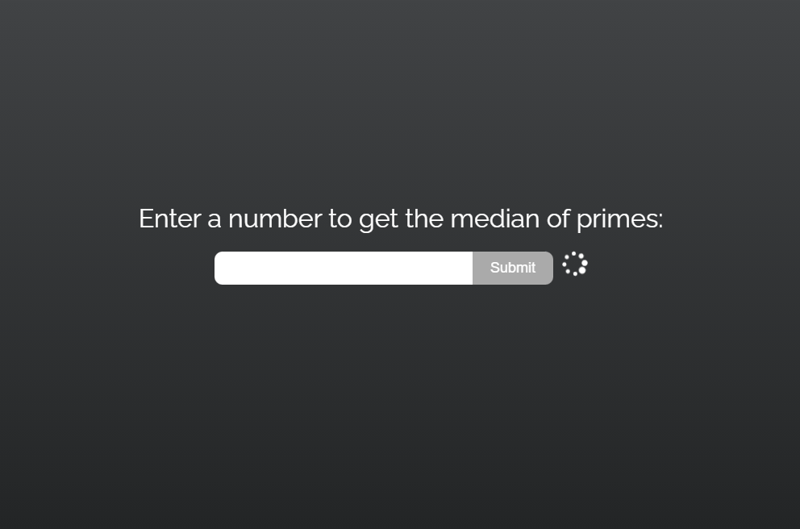
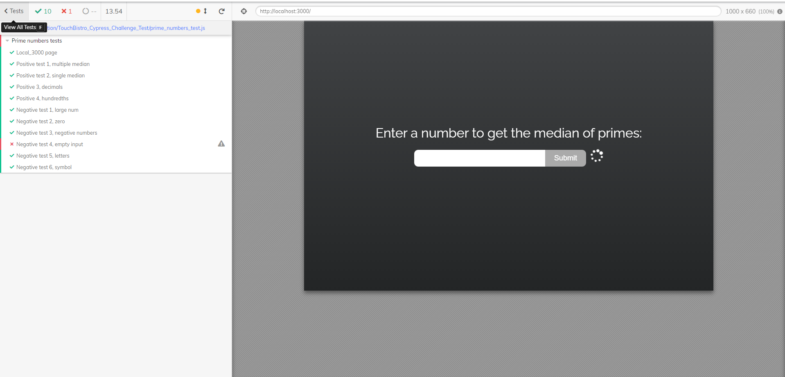

# There are UI and API tests in this repository.

### Running The App

### Run

```
npm start
```

- in the main folder in your command line to start the server and go to http://localhost:3000 in your browser to view the app.

### Ok, so now we are ready to set up the project. In the first step run the terminal

### Install Dependencies for Cypress

### Create npm package:

### Run

```
mkdir cypress_challenge_test => cd TouchBistro_Cypress_Challenge_Test
```

### Create npm package:

```
npm init -y
```

### Now install Cypress:

`npm install --sav-dev cypress`

### It will start Cypress and create a cypress folder.

```
 npx cypress open
```

# Scenarios

### Positive Tests

1. Positive scenario - multiple median value

   - Input 10
   - Expect [3,5]

2. Positive scenario - single median value

   - Input 18
   - Expect [7]

3. Positive scenario - decimals value

   - Input 2.6
   - Expect [2]

4. Positive scenario - hundredths value

   - Input 8.24
   - Expect [3,5]

### Negative Tests

1. Negative scenario - large numbers value

   - Input 9007199254740991
   - Expect [] => (alert) Number exceeds limit

2. Negative scenario - zero

   - input - 0
   - Expect [,] => It would be preferable to throw the error.

3. Negative scenario - negative numbers

   - Input -18
   - Expect [,] => It would be preferable to throw the error.

4. Negative scenario - empty input

   - input - nothing
   - Expect error message => Cannot accept an empty string. You need to actually type something.

5. Negative scenario - letters

   - input - "abs"
   - Expect [,] => The code is stuck and the loading icon keeps spinning => Error: Request failed with status code 404

6. Negative scenario - symbol

   - input - "$@&"
   - Expect "" => The code is stuck and the loading icon keeps spinning => Error: Request failed with status code 404

- 

- 

### Bugs and suggestions

- There is an issue in negative tests 5 and 6. When I transfer letters and symbols to the input in the test, the page becomes stuck and the loader keeps spinning after I click submit.
- I believe that instead of using a comma in negative tests 2 and 3, it would be preferable to throw the error.
